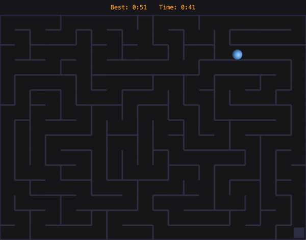

# Matter Maze 🌀
A responsive maze game built with [Matter.js](https://brm.io/matter-js/)



## About
**Matter Maze** is a dynamic and responsive game built using Matter.js, a 2D physics engine. The game challenges players to navigate **randomly generated maze paths** while keeping track of their best completion time**

---
- No two mazes are the same! - A new random maze is generated each time
- Best completion time is saved so you can keep track of your best score
- The maze adapts dynamically to browser resizing
- Built with physics-based movement and collision detection

## Running The Game
1. Clone the repository:
2. ```git clone https://github.com/jensuki/Matter-Maze.git ```
3. ```cd Matter-Maze```
4. Open `index.html` in your browser


To change the complexity of the maze, update these values in the `maze.js` file:
```sh
const cellsHorizontal = 20  // # of columns
const cellsVertical = 15    // # of rows
 ```